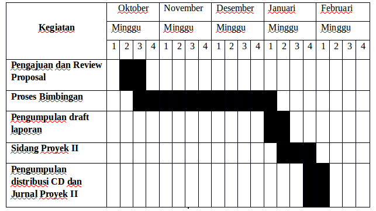

<h2 align="center">BAB I   PENDAHULUAN</h2>
<strong>1.1 Latar Belakang</strong>

Di era saat ini sampah yang tidak bisa dimanfaatkan atau didaur ulang menjadi masalah umum pada setiap kota besar. Bahkan di beberapa kota menjadi masalah yang serius yang dapat menimbulkan ketidak nyaman terhadap masyarakat itu sendiri. Dengan kemajuan teknologi, masalah seperti ini dapat menjadi solusi untuk mengurangi dampak yang ditimbulkan dari proses pengumpulan sampah yang masih konvensional, dengan berkembangnya teknologi dirancang sebuah Smart Trash Bin yang bisa merespon otomatis pada pengelolaan sampah yang belum bisa dipilah menjadi dua bagian organik dan non-organik dimana untuk mengetahui sampah yang bisa dimanfaatkan dan didaur ulang yang akan diambil oleh petugas pengangkut sampah. Tempat sampah yang belum bisa diketahui lokasinya oleh petugas pengakut sampah akan mempersulit pengambilan sampah. Selain itu kepala petugas pengakut sampah belum bisa mengetahui posisi lokasi petugas pengakut dan posisi lokasi tempat sampah.
  
Maka dengan adanya permasalah tersebut, penulis mengusulkan Proposal Proyek II yang berjudul <i>“Pengembangan SIGAMAci (Smarttong Integrated Garbage Management system For Smart City) Berbasis IoT (Internet of Things)”</i>. Yang dimana akan dibuat sebuah Smart Trash Bin yang bisa mengelola sampah organik dan non-organik yang bisa dimanfaatkan atau didaur ulang, selain itu akan dibuat aplikasi yang diharapkan memudahkan petugas pengangkut sampah bisa mengetahui tempat sampah yang akan diambil, selain itu kepala petugas pengangkut dapat mengetahui dimana lokasi tempat sampah dan lokasi petugas penangkut berada. Jadi, dalam pengembangan ini penulis mengintegrasikan Smart Trash Bin dengan system untuk mempermudah petugas pengangkut sampah memilah sampah. 
  
Dengan prototype tempat sampah pintar yang akan dikembangkan menggunakan mikrokontroller arduino mega yang bisa memilah sampah organik dan non-organik yang menggukan sensor <i>autonics proximity cr30-15dn</i> yang difungsikan untuk memilah sampah, selain itu juga beberapa sensor diantaranya  sensor jarak menggunakan sensor ultrasonik  untuk indikator ketinggian sampah pada tempat sampah pintar, motor servo sebaagai pengendali pintu otomatis tempat smapah pintar, dan lcd untuk mengetahui sampah yang dibuang organik atau non-organik.

 
<strong>1.2 Identifikasi Masalah</strong>

Berdasarkan latar belakang tersebut dapat di identifikasi bahwa permasalahan yang ada adalah:
 1. Pengelolaan sampah yang belum efektif dan belum bisa dimanfaatkan.
 
2. Informasi tentang petugas pengangkut yang belum efektif.
 
3. Belum lokasi tempat sampah yang bisa diketahui.

 
<strong>1.3 Tujuan dan Manfaat</strong>
 
 
<strong>1.3.1 Tujuan</strong>

Berdasarkan uraian latar belakang masalah, maka tujuan penyusunan proposal Proyek II yang berjudul <i>“Pengembangan SIGAMAci (Smarttong Integrated Garbage Management system For Smart City) Berbasis IoT (Internet of Things)”</i> ini adalah:
 
1. Pengelolaan sampah yang bisa dimanfaatkan yang dipilah secara   
otomatis antara organik dan non-organik.
 
2. Mengetahui lokasi petugas pengangkut.
 
3. Mengetahui lokasi tempat sampah.

 
<strong>1.3.2 Manfaat</strong>

Manfaat dari penyusunan proposal ini adalah sebagai berikut:
 
Bagi pengelola sistem administrasi:
 
1. Mengetahui sampah yang bisa dimanfaatkan.
 
2. Mengetahui lokasi petugas pengangkut sampah berada.
 
Bagi ilmu pengetahuan :
 
Membuktikan IoT <i>(Internet of Things)</i> bisa bermanfaat bagi manusia dan dapat digunakan dalam aspek-aspek kehidupan sehari-hari termasuk dalam pengelolaan sampah pada lingkungan.

 
<strong>1.4 Ruang Lingkup</strong>

Dalam penyusunan proposal proyek II, penulis membatasi pembahasan hanya pada:
 
1. Analisis sistem hanya meliputi: 
 
&nbsp;&nbsp;&nbsp;&nbsp;&nbsp;a. Memberikan data lokasi tempat sampah. 
 
&nbsp;&nbsp;&nbsp;&nbsp;&nbsp;b. Memberikan data lokasi petugas pengangkut sampah. 
 
2. Pembuatan desain tempat sampah pintar berbasis IoT yang dapat memilah sampah organik dan non-organik yang terintegrasi dengan sistem administrasi pengelolaan sampah.
 
3. Perancangan tempat sampah pintar berbasis IoT yang dapat memilah sampah organik dan non-organik yang terintegrasi dengan sistem administrasi pengelolaan sampah.

 
<strong>1.5 Jadwal Kegiatan Pengerjaan Proyek</strong>

    
     
    Tabel 1.1 Jadwal Kegiatan Pengerjaan Proyek

